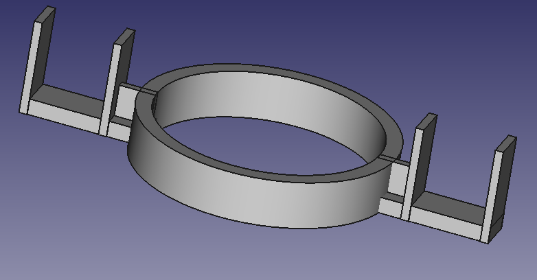

# 3-d printed part for Toilet tank
This a a toilet tank part meant for older toilet tanks.  
If you buy the parts ( flapper + float) for the  older tank it will be about 17 dollars. it is also more difficult to find this part.

If you use the 3d printed part (a ring with 2 prongs) + a flapper it will cost you about 30 cents + $2 = $2.30 approximately

## 3d rendering of the part by FreeCAD:

## The actual 3d printed part. Image 1:

## The actual 3d printed part. Image 2:

## The actual 3d printed part. Image 3:

## An image of the part for which I made the alternative. For illustration only:

